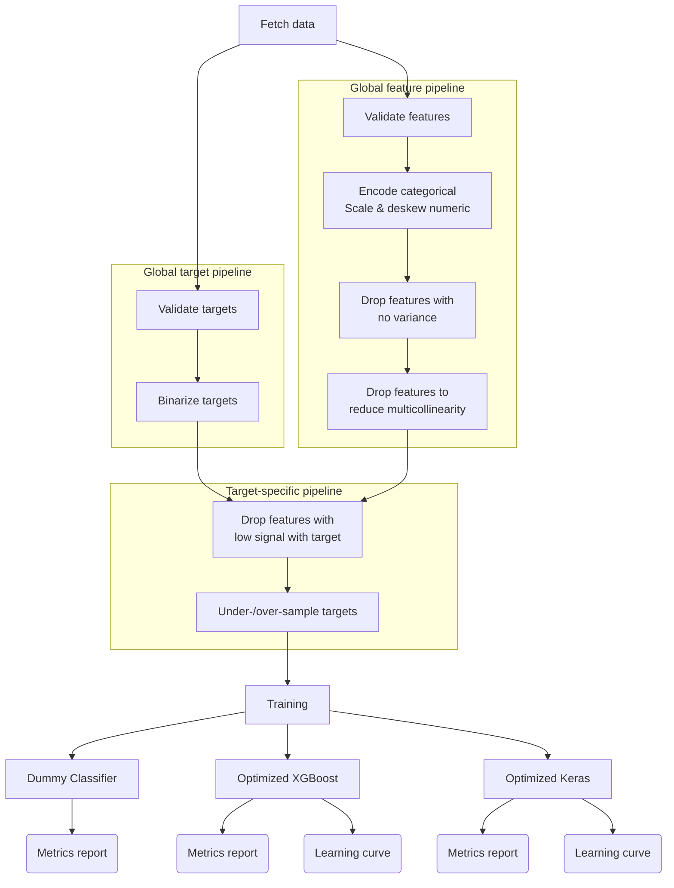

# Disease Risk Prediction

Predict a risk score for common diseases based on input patient data.

## Overview

This project involves building a deep learning model using Keras
to predict the likelihood of common diseases based on patient demographics and symptoms.
The app will fetch real-world health data via an API, process it, and provide users with personalized risk scores.

Point of project is to show cleaning real, messy healthcare data, to experiment with deep-learning predictors, and to present a UI. Not really trying to show this as a reliable predictor!
Limited to surveyees understanding of their own health risks.

## Table of Contents

-   [Installation](#installation)
-   [Usage](#usage)
-   [Data](#data)
-   [Model](#model)
-   [Results](#results)
-   [Contributing](#contributing)
-   [License](#license)

## Installation

// Placeholder for installation instructions

## Usage

// Placeholder for usage instructions

## Data

// Placeholder for data description

## Model

// Placeholder for model description

## Results

// Placeholder for results

## Contributing

// Placeholder for contributing guidelines

## License

// Placeholder for license information

```shell
uv run --with jupyterlab jupyter lab &
```


